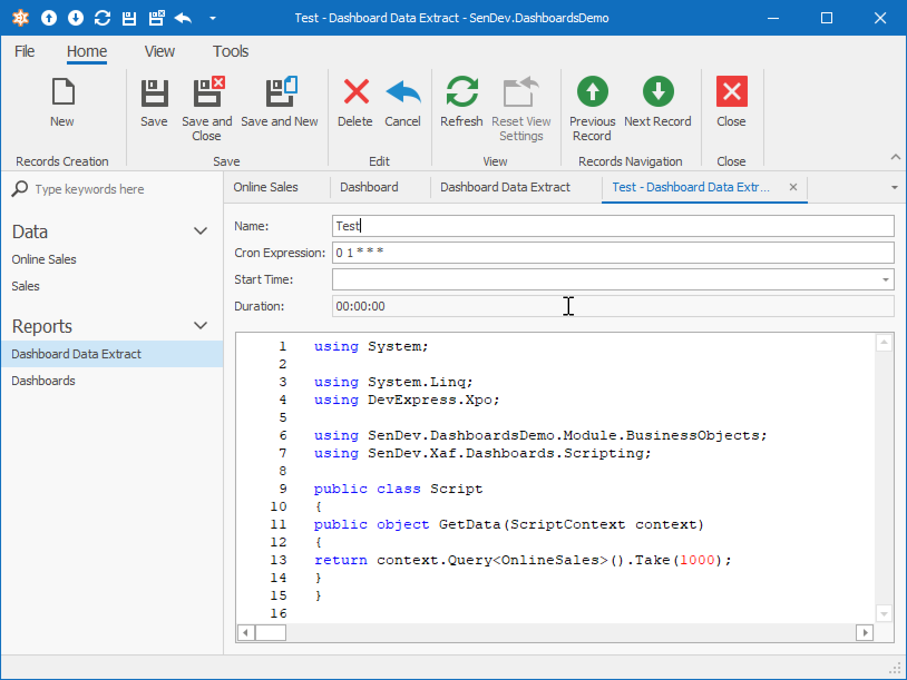

# SenDev XAF Dashboards
[](https://dev.azure.com/SenDevGmbH/XafDashboards/_build/latest?definitionId=1&branchName=master)

## Introduction
This module adds 2 new data sources to the DevExpress XAF Dashboards module:
 * C# Script Data Source
 * XAF Data Extract Data Source

### C# Script Data Source
C# Script data source allows to specify dashboard data source through C# Scripts at runtime.

### XAF Data Extract Data Source
With a [Data Extract Data Source](https://documentation.devexpress.com/Dashboard/115900/Creating-Dashboards/Creating-Dashboards-in-the-WinForms-Designer/Providing-Data/Extract-Data-Source), XAF Dashboards enable you to store dashboard data in an optimized format for data grouping and other dashboard operations. Through a Data Extract Data Source, large amounts of data can be stored in a compact format and be quickly loaded into dashboards. For example, queries with large amounts of data can execute and create data extract nightly. Prepared data extracts can then be quickly loaded into the dashboards. 

XAF Data Extract Data Source has following features:
 * Memory-optimized creation of data extracts for large datasets. 
 * Storing data extracts in the database
 * Specify Data Source with C# scripts


## Getting started
### Installing SenDev.XafDashboard packages into your application modules
Nuget packages are available for multiple DevExpress versions. To install SenDev.Xaf.Dashboard packages for a specific DevExpress version, please pick the version corresponding to the one you have installed. For example, if you have DevExpress 18.2.6, pick the SenDev.XafDashboard 18.2.6.xx where xx is the number of the latest build. Specify the version with the `-Version` parameter of the `Install-Package` command. If you skip the version parameter, the latest package version for the latest supported DevExpress version will be installed.

#### Platform agnostic module
Install the package with following command in the Visual Studio Package Manager Console 
```Console
Install-Package SenDev.Xaf.Dashboards -IncludePrerelease
```

Add following line in the InitializeComponent method in Module.Designer.cs:
```C#
this.RequiredModuleTypes.Add(typeof(SenDev.Xaf.Dashboards.SenDevDashboardsModule));
```

#### Windows module
Install the package with following command in the Visual Studio Package Manager Console 
```Console
Install-Package SenDev.Xaf.Dashboards.Win -IncludePrerelease
```

Add following line in the InitializeComponent method in WinModule.Designer.cs:
```C#
this.RequiredModuleTypes.Add(typeof(SenDev.Xaf.Dashboards.Win.SenDevDashboardsWinModule));

```

#### Web module
Install the package with following command in the Visual Studio Package Manager Console 
```Console
Install-Package SenDev.Xaf.Dashboards.Web -IncludePrerelease
```

Add following line in the InitializeComponent method in WebModule.Designer.cs:
```C#
this.RequiredModuleTypes.Add(typeof(SenDev.Xaf.Dashboards.Web.SenDevDashboardsWebModule));
```

### Using Script Data Source
Start the application.
Goto Dashboards and click on "New".
Select "C# Script Data Source":


Click Next and specify the script:


You can use following script template:

```C#
using System;

using System.Linq;
using DevExpress.Xpo;	

using SenDev.DashboardsDemo.Module.BusinessObjects;
using SenDev.Xaf.Dashboards.Scripting;		


public class Script
{
    public object GetData(ScriptContext context)
    {
        return context.Query<OnlineSales>().Take(1000);
    }
}
```

### Using XAF Data Extract Data Source

You need to first create a data extract.
Goto _Dashboard Data Extract_ Navigation Item.
Click on "New".
Enter a data extract name and its script.



You can use the same template as for the Script Data Source above.
Then Click on _Save & Close_.
In the list view use the "Update Data" button to create data extract: 


After the data extract is created, you can use it in a dashboard.
Goto dashboards, click on "New". 
In the data source window select "XAF Data Extract": 


On the next page select the data extract that you created previously:


Then click on "Finish".
Your Data Extract Data Source is ready!

#### Scheduling Updates of Data Extracts
No built-in job scheduler is provided with the package.
However the demo application implements a scheduler by using [Hangfire](https://www.hangfire.io),
Feel free to use the code in your applications.

It is possible to easily integrate your preferred scheduler by implementing the `IJobScheduler` interface.

## Additional Features

### Saving state of web dashboards


## Development

### Pre-requisites
* Visual Studio 2017
* Microsoft SQL Server 2017 or higher
* DevExpress Universal Suite 18.2

### Database
Download the [Contoso BI Demo DataSet](https://www.microsoft.com/en-us/download/details.aspx?id=18279).
Restore the database, use ContosoRetailDW for database name. 
Connection Strings in the applications are configured to use the default SQL Server instance.
If you are not using the default instance, please modify the connection strings accordingly.
After opening the SenDev.Xaf.Dashboards.sln in Visual Studio, go to the solution properties and set the SenDev.Xaf.Dashboards.Win and SenDev.Xaf.Dashboards.Web projects to "Start":


The web application needs to always be started, since it is hosting a WCF Service for job scheduler.

